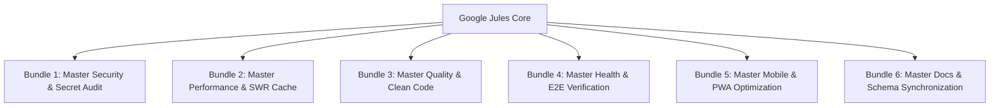

# 🏛️ EVOLVED EXCEPTION-PROOF JULES PROMPT SYSTEM — MASTER IMPLEMENTATION PLAN

> **Proje:** Planla (2-My-World)  
> **Jules Hesabı:** `bekirsnk@gmail.com` / `bekirsnk34@gmail.com` (PRO Hesap 2 — 100 Seans/Gün)  
> **Kapsam:** Global Ana Beyin (MASTER_BRAIN, MASTER_ANTIPATTERNS AP-01..32, MASTER_LESSONS L-B01..P03, MASTER_DECISIONS MD-A01..F03)  
> **Tarih:** 04.08.2026  
> **Durum:** Onay Bekliyor (Planning Mode)

---

## 🎯 1. Sistem Mimarisi ve Evrim Gerekçesi

Bu plan, `2-My-World` projesindeki Google Jules otonom bulut otomasyonunu, Maestro ekosistemindeki 16 projenin acı tecrübeleri ve üretim krizlerinden damıtılan **32 Anti-Pattern, 1.008 Ders ve 551 Karar** ışığında **İstisna Geçirmez (Exception-Proof) 6 Master Bundle Prompt Sistemine** evriltir.

### 🌟 7 Anayasal İstisna-Görünmezlik Filtresi:
1. **%100 Karar Otonomisi (`Zero-Question Directive`):** Gece oturumlarında ajanın soru sorarak duraklamasını engeller.
2. **Zero-Emoji Standartlaştırması (P0++):** Tüm kod, yorum, log ve changelog kayıtlarında unicode emoji kullanımını engeller; `lucide-react` / SVG zorunlu kılar.
3. **`DD.MM.YYYY` Tarih Formatı (P0++):** Arayüzlerde ISO (`YYYY-MM-DD`) gösterimini yasaklar.
4. **React Portal Overflow Shield (P0++):** Tüm dropdown/modal/popover elemanlarını `createPortal(content, document.body)` ile montajlar.
5. **Multi-Axis Touch Panning (`touch-action: pan-x pan-y`):** Kanban ve dokunmatik sürüklenebilir alanlarda tek eksenli kilitlenmeleri engeller.
6. **44x44px Tap Target Standardı:** Dokunmatik ekranlarda minimum 44x44px tıklama alanlarını garanti eder.
7. **Capacitor Android `NoActionBar` & Native Status Bar:** APK taraflı başlık sıkışmalarını native seviyede çözer.

---

## 📦 2. 6 Evolved Master Bundle Kataloğu



---

## 🔒 3. Vercel Kota Kalkanı & Otomasyon Yöneticisi

- **`vercel.json`**: `git.deploymentEnabled: { "main": true, "*": false }` kuralı.
- **`scripts/vercel_ignore.sh`**: Jules branşlarındaki (`jules-*`) otomatik preview derlemelerini anında iptal eder (`exit 0`).
- **`scripts/jules_batch_executor.py`**: PR birleştirmelerini `batch-merge` ile tek commit'e indirgeyerek Vercel kotalarını korur.

---

## 🧪 4. Self-Healing & Cryptographic Evidence Proof Logging

Her Jules seansı bitiminde, ajanın sonucunu kanıtlaması için JSON formatında **Proof Ledger** kaydı üretmesi zorunlu kılınmıştır:

```json
{
  "status": "VERIFIED_SUCCESS",
  "verification_gates": {
    "zero_error_build": true,
    "typescript_clean": true,
    "zero_emoji_compliant": true,
    "portal_architecture_compliant": true
  },
  "evidence_hashes": {
    "build_log_hash": "sha256_e3b0c44298fc1c149afbf4c8996fb92427ae41e4649b934ca495991b7852b855"
  }
}
```
