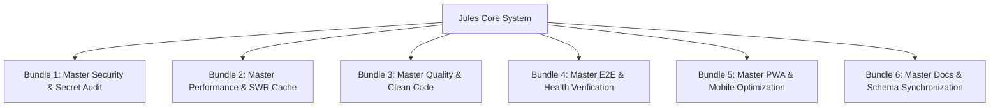

# 🏛️ 2-My-World Google Jules Otonom Sistem ve Prompt Bundle Mimarisi Master Planı

> **Proje:** Planla (2-My-World)  
> **Jules Hesabı:** `bekirsnk@gmail.com` / `bekirsnk34@gmail.com` (PRO Hesap 2 — 100 Seans/Gün)  
> **Referans Mimari:** `6-Crm Panel` Otonom Jules Altyapısı & Vercel Kota Koruması  
> **Tarih:** 04.08.2026  
> **Durum:** Onay Bekliyor (Planning Mode)

---

## 🎯 1. Proje Amacı ve Genel Bakış

Bu plan, `2-My-World` projesindeki Google Jules bulut otomasyonunu parçalanmış tekil prompt'lardan **modüler, tutarlı ve disiplinli Master Prompt Bundle'lara** yükseltmeyi amaçlar.

### 🌟 Ana Hedefler:
1. **Tek Hesap İzolasyonu:** Tüm Jules seanslarını `bekirsnk@gmail.com` (`bekirsnk34@gmail.com` PRO Hesap 2) anahtarı ile çalıştırmak.
2. **Vercel Kota Kalkanı (Vercel Build Shield):** `scripts/vercel_ignore.sh` ve `vercel.json` ekleyerek Jules branşlarındaki otomatik Vercel preview deployment'larını **tamamen durdurmak**, Vercel günlük/aylık derleme kotalarını sıfır israfla korumak.
3. **6 Master Prompt Bundle Mimarisi:** 24 tekil prompt'u 6 mantıksal pakette (Bundle) toplamak; her pakete `%100 Karar Otonomisi`, `Zero-Emoji` ve `Build Verification Gate` yeteneği kazandırmak.
4. **.jules Anayasa Klasörü:** Bulut ajanı Jules'un seans açtığında doğrudan okuyacağı `.jules/MASTER_INSTRUCTIONS.md`, `.jules/autonomy.md` ve `.jules/ux_standards.md` dosyalarını oluşturmak.
5. **Toplu PR Harmanlama (Batch-Merge):** `scripts/jules_batch_executor.py` üzerinden `batch-merge` ile açık Jules PR'larını yerel `pnpm run build` kapısından geçirip tek commit halinde `main`'e aktarmak.

---

## 🏗️ 2. Mimarinin Katmanları ve Bileşen Yapısı

```
2-My-World/
├── .jules/                                  # Bulut Ajanı Jules Anayasa Klasörü
│   ├── MASTER_INSTRUCTIONS.md               # 2-My-World Master Anayasası & Bundle Kataloğu
│   ├── autonomy.md                          # %100 Karar Otonomisi & Soru Sorma Yasağı
│   ├── cache_architecture.md                # Fast API RAM/Disk + SWR Önbellek Kuralları
│   └── ux_standards.md                      # UI/UX, Touch Targets (44px), Mobile & PWA Kuralları
├── vercel.json                              # Vercel Kök Yapılandırması (Ignore Command Entegrasyonlu)
├── scripts/
│   ├── vercel_ignore.sh                     # Jules & Preview Branşlarını Vercel'de Atlayan Script
│   ├── jules_batch_executor.py              # CLI Yönetimi (list, resume-waiting, status-sync, batch-merge)
│   ├── trigger_jules.py                     # PRO Hesap 2 Entegreli Dinamik Prompt Çalıştırıcısı
│   └── auto_trigger_queue.py               # Sıralı 10-Dakika Kuyruk Yöneticisi
└── docs/jules/
    ├── JULES_PRO_PROMPTS_LIBRARY.md         # 6 Master Bundle & 24 Yenilenmiş Prompt Kütüphanesi
    ├── JULES_AUTOMATION_REGISTRY.md         # Otomasyon Takvimi & Zamanlayıcı Kataloğu
    ├── JULES_TASKS_REPORT.md                # Durum Raporu
    └── JULES_CHANGELOG.md                   # Türkçe Değişiklik Günlüğü
```

---

## 📦 3. 6 Master Prompt Bundle Taksonomisi (2-My-World Özelinde)

Her Master Bundle, 4 mikro-görevi kapsayacak şekilde yapılandırılmıştır.



### 🛡️ BUNDLE 1: Master Security & Secret Audit (`master-security`)
- **Kapsam:** Hardcoded secrets, API anahtar sızıntısı, Pydantic 422/500 backend doğrulamaları, Auth token süresi.
- **Mikro-Görevler:**
  - `P1-security-secret`: Koda gömülü secret taraması.
  - `P2-security-vuln`: pnpm audit & Python bağımlılık güvenlik taraması.
  - `P3-security-auth`: JWT token ve auth flow doğrulama.
  - `P4-security-cors`: FastAPI CORS ve domain kısıtlamaları.

### ⚡ BUNDLE 2: Master Performance & SWR Cache (`master-performance`)
- **Kapsam:** Bundle size, Next.js dynamic import'lar, Neon SQL sorgu süreleri, SWR deduplication.
- **Mikro-Görevler:**
  - `P5-perf-bundle`: Next.js bundle ve ağır paket (Lucide, Recharts vb.) analizi.
  - `P6-perf-response`: FastAPI rotalarının yanıt süreleri & async uyuşmazlıkları.
  - `P7-perf-query`: Neon PostgreSQL indeks ve yavaş sorgu optimizasyonu.
  - `P8-perf-swr`: React SWR `dedupingInterval` ve istemci önbellek denetimi.

### 🧹 BUNDLE 3: Master Quality & Clean Code (`master-quality`)
- **Kapsam:** Dead code, `any` type kullanımı, ESLint flat config, god components (>300 satır).
- **Mikro-Görevler:**
  - `P9-code-dead`: Kullanılmayan importlar, `console.log` ve ölü kodların temizlenmesi.
  - `P10-code-strict`: TypeScript strict mode ve explicit interface tanımları.
  - `P11-code-component`: 300+ satırlı bileşenlerin sub-component'lara bölünmesi.
  - `P12-code-eslint`: Lint uyarılarının ve `prefer-const` kurallarının tamiri.

### 🧪 BUNDLE 4: Master E2E & Health Verification (`master-health`)
- **Kapsam:** API endpoint canlılık testleri, Next.js build doğrulaması, offline senkronizasyon kuyruğu.
- **Mikro-Görevler:**
  - `P13-test-health`: Backend rotaları için otomatik pytest durum kontrolleri.
  - `P14-test-build`: `app/web` pnpm build sıfır hata testi.
  - `P15-test-e2e`: Temel kullanıcı akışlarının uçtan uca simülasyonu.
  - `P16-test-offline`: Service Worker ve offline veri yazma kuyruğu doğrulaması.

### 📱 BUNDLE 5: Master PWA & Mobile Optimization (`master-mobile`)
- **Kapsam:** Capacitor Android uyumluluğu, 44x44px dokunma hedefleri, rubber-band kilitleri, NoActionBar stili.
- **Mikro-Görevler:**
  - `P17-mobile-touch`: Mobil ekranlarda minimum 44x44px dokunma alanı denetimi.
  - `P18-mobile-pwa`: Service Worker (`sw.js`) ve Web Manifest güncelliği.
  - `P19-mobile-capacitor`: Capacitor config, Android theme (`NoActionBar`) ve plugin denetimi.
  - `P20-mobile-viewport`: Dynamic safe-area padding ve mobil rubber-band scroll kilitleri.

### 📚 BUNDLE 6: Master Docs & Schema Synchronization (`master-docs`)
- **Kapsam:** OpenAPI / Swagger doküman senkronizasyonu, README güncelliği, Alembic DB migration uyumu.
- **Mikro-Görevler:**
  - `P21-docs-api`: FastAPI OpenAPI şemasının frontend tipleriyle senkronizasyonu.
  - `P22-docs-readme`: Proje README ve mimari rehberlerin güncellenmesi.
  - `P23-docs-migration`: Alembic veritabanı migrasyonlarının canlı DB ile hizalanması.
  - `P24-docs-changelog`: `JULES_CHANGELOG.md` dosyasının standart Türkçe formatta tutulması.

---

## 🔒 4. Vercel Kota Kalkanı (Vercel Build Shield) Mimarisi

Vercel'deki **günlük 100 dakikalık build kotasını** ve preview limitlerini korumak için uygulayacağımız adımlar:

### 1. `vercel.json` (Kök Dizin)
```json
{
  "ignoreCommand": "if [ -f ./scripts/vercel_ignore.sh ]; then bash ./scripts/vercel_ignore.sh; else exit 1; fi",
  "git": {
    "deploymentEnabled": {
      "main": true,
      "*": false
    }
  }
}
```

### 2. `scripts/vercel_ignore.sh`
```bash
#!/usr/bin/env bash
# Vercel Build Ignore Script for 2-My-World

COMMIT_REF="${VERCEL_GIT_COMMIT_REF:-}"
AUTHOR="${VERCEL_GIT_COMMIT_AUTHOR_LOGIN:-}"
COMMIT_MSG="${VERCEL_GIT_COMMIT_MESSAGE:-}"

# 1. Block any Jules branch or commit
if [[ "$COMMIT_REF" == jules-* ]] || [[ "$COMMIT_REF" == *jules* ]] || [[ "$AUTHOR" == *jules* ]] || [[ "$AUTHOR" == *google-jules* ]]; then
  echo "🚫 [CANCEL BUILD] Jules branch or commit detected ($COMMIT_REF / $AUTHOR). Skipping Vercel build."
  exit 0
fi

# 2. Block non-main branch preview builds
if [[ "$COMMIT_REF" != "main" ]] && [[ -n "$COMMIT_REF" ]]; then
  echo "🚫 [CANCEL BUILD] Non-main branch ($COMMIT_REF). Skipping Vercel preview build."
  exit 0
fi

# 3. Check commit message for explicit skip flags
if [[ "$COMMIT_MSG" == *"[skip vercel]"* ]] || [[ "$COMMIT_MSG" == *"[no-deploy]"* ]]; then
  echo "🚫 [CANCEL BUILD] Commit message contains skip flag. Skipping Vercel build."
  exit 0
fi

echo "✅ [PROCEED BUILD] Main branch user commit detected. Proceeding with Vercel build."
exit 1
```

---

## ⚡ 5. Uygulama Adımları ve Zaman Planı

1. **Aşama 1 (Dosya Kurulumları):**
   - `.jules/` dizininin ve 4 anayasal kılavuzun oluşturulması.
   - Root `vercel.json` ve `scripts/vercel_ignore.sh` eklenmesi.
2. **Aşama 2 (Prompt Kütüphanesi & Script Yenileme):**
   - `docs/jules/JULES_PRO_PROMPTS_LIBRARY.md` dosyasının 6 Master Bundle ve 24 prompt ile baştan hazırlanması.
   - `scripts/trigger_jules.py` ve `scripts/jules_batch_executor.py` scriptlerinin yeni taksonomiyle güncellenmesi.
3. **Aşama 3 (Test & Doğrulama):**
   - Local CLI testleri (`list`, `status-sync`, `resume-waiting`, `batch-merge`).
   - Push & GitHub Actions verification.

---

## 🧪 6. Doğrulama Planı

### Otomatik Testler
- `python3 scripts/jules_batch_executor.py list`
- `python3 scripts/jules_batch_executor.py status-sync`
- `cd app/web && pnpm run build`
- `bash scripts/vercel_ignore.sh` (Dry run)

### Manuel Doğrulama
- Vercel Dashboard üzerinde Jules PR'larının derlemeye girmediğinin (Skipped) teyit edilmesi.
- PRO Hesap 2 (`bekirsnk@gmail.com`) kotasının sorunsuz çalıştığının doğrulanması.
