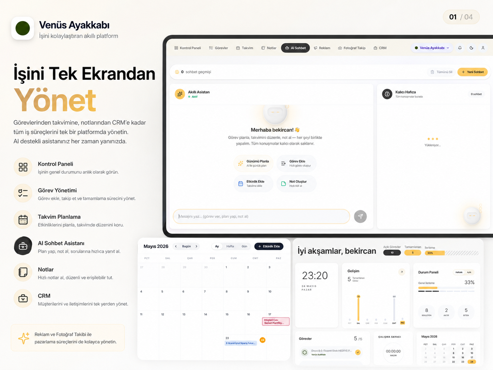
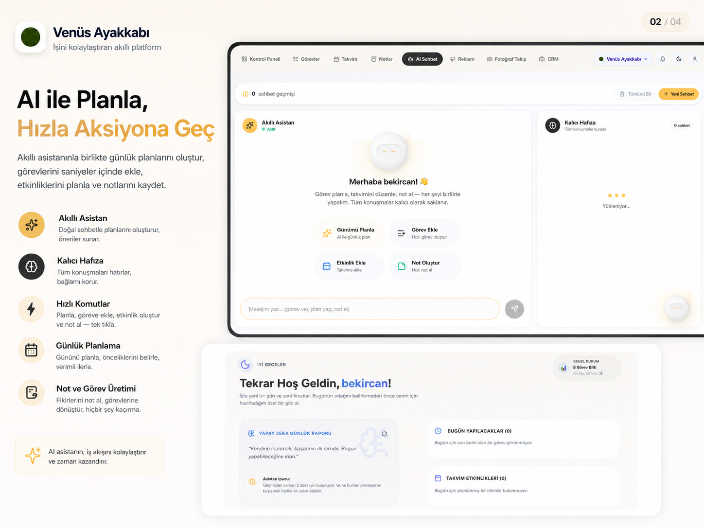
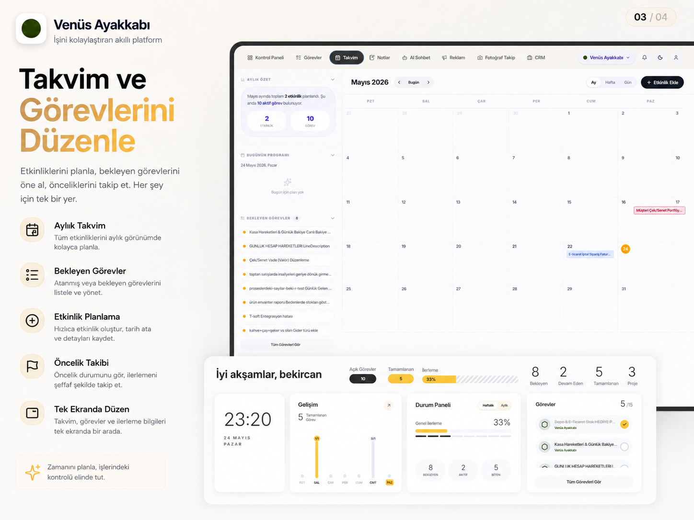
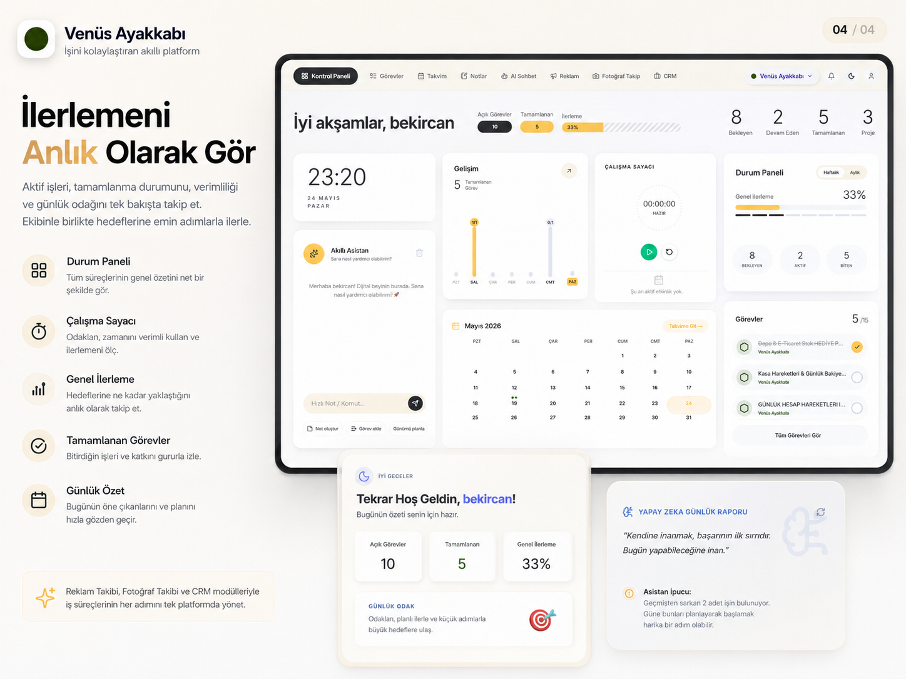

# Pikseliş

**Yapay Zeka Destekli Kişisel Yaşam ve İş Yönetim Sistemi**

Pikseliş, iş akışlarınızı, takviminizi ve günlük hedeflerinizi tek bir merkezden yöneten akıllı bir yaşam asistanıdır. Masaüstünden mobile kadar tüm cihazlarda eşzamanlı, hızlı ve çevrimdışı (offline-first) çalışacak şekilde tasarlanmıştır.

---

## 📸 Uygulama Arayüzü

### 1️⃣ Genel Bakış & Kontrol Paneli
Tüm iş süreçlerinizi, aktif görevlerinizi ve günlük odağınızı tek bir kompakt ekrandan takip edin.

<p align="center">
  
</p>

---

### 2️⃣ Akıllı Yapay Zeka Asistanı
Doğal dilde konuşarak günlük planlar yapın, hızlıca görev oluşturun ve asistanınızın kalıcı hafızasıyla kararlarınızı destekleyin.

<p align="center">
  
</p>

---

### 3️⃣ Gelişmiş Takvim & Görev Düzenleme
Dokunmatik ekranlarla uyumlu sürükle-bırak takvimi ve bekleyen görevler listesiyle zamanınızı kolayca planlayın.

<p align="center">
  
</p>

---

### 4️⃣ Çalışma Sayacı & İlerleme Takibi
Entegre çalışma sayacı ile odaklanma sürelerinizi ölçün ve verimlilik istatistiklerinizi anlık olarak izleyin.

<p align="center">
  
</p>

---

## 🏗️ Teknoloji Yığını

- **Frontend:** Next.js 15 (App Router) · TypeScript · Zustand · shadcn/ui · Tailwind CSS
- **Backend:** FastAPI · SQLAlchemy 2.0 · Python 3.14 · PostgreSQL / SQLite
- **Mobil & PWA:** Capacitor 6 · Serwist (PWA) · IndexedDB (Yerel Önbellek)
- **Yapay Zeka:** Google Gemini API

---

## 🛠️ Kurulum ve Çalıştırma

### 1. Backend Sunucusu
```bash
cd app/backend
python3 -m venv venv
source venv/bin/activate
pip install -r requirements.txt
cp .env.example .env
uvicorn app.main:app --reload --port 8000
```

### 2. Frontend İstemcisi
```bash
cd app/web
npm install
cp .env.example .env.local
npm run dev
```

---
© 2026 Pikseliş Project.
