# 📧 My World — E-Posta Tabanlı Kimlik Doğrulama Yol Haritası

## 🔍 Mevcut Durum Analizi

### Şu Anda Var Olanlar
| Bileşen | Durum | Detay |
|---------|-------|-------|
| `User` modeli → `email` alanı | ✅ Mevcut | `String(100), nullable=True` — opsiyonel alan |
| Kullanıcı oluşturma → e-posta girişi | ✅ Mevcut | `CreateUserModal`'da "E-Posta (Opsiyonel)" alanı var |
| `/me` endpoint → email dönüşü | ✅ Mevcut | Response'ta `email` alanı dönüyor |
| Giriş sistemi | ⚠️ Sadece username | `username + password` ile OAuth2 form |
| Şifre sıfırlama | ⚠️ Güvensiz | `username + new_password` ile **e-posta doğrulaması olmadan** doğrudan değiştiriyor |
| SMTP / E-posta gönderimi | ❌ Yok | Hiçbir e-posta gönderim altyapısı kurulmamış |
| E-posta doğrulama (verification) | ❌ Yok | Kayıt sonrası e-posta doğrulama akışı yok |
| Token bazlı şifre sıfırlama | ❌ Yok | Güvenli reset token sistemi yok |

### Mevcut Kimlik Doğrulama Akışı
```mermaid
flowchart LR
    A[Kullanıcı] -->|username + password| B[/api/auth/login]
    B -->|JWT Token| C[Sisteme Giriş]
    D[Admin] -->|username + password + name| E[/api/admin/users - POST]
    E -->|Kullanıcı Oluştur| F[DB'ye Kaydet]
```

---

## 🎯 Hedef: E-Posta Tabanlı Kimlik Doğrulama Sistemi

### Hedeflenen Yeni Akış

```mermaid
flowchart TB
    subgraph KAYIT["📝 Kayıt Akışı"]
        R1[E-posta + Şifre + Ad Soyad] --> R2[Hesap Oluştur]
        R2 --> R3[Doğrulama E-postası Gönder]
        R3 --> R4[Kullanıcı Linke Tıklar]
        R4 --> R5[E-posta Doğrulandı ✅]
    end

    subgraph GIRIS["🔐 Giriş Akışı"]
        G1[E-posta VEYA Kullanıcı Adı] --> G2[+ Şifre]
        G2 --> G3[JWT Token Üret]
        G3 --> G4[Sisteme Giriş ✅]
    end

    subgraph SIFRE["🔑 Şifre Sıfırlama"]
        S1[E-posta Gir] --> S2[Sıfırlama Linki Gönder]
        S2 --> S3[Kullanıcı Linke Tıklar]
        S3 --> S4[Yeni Şifre Belirle]
        S4 --> S5[Şifre Güncellendi ✅]
    end
```


---

## ⚙️ Ne Gerekiyor? Neyi Almamız Lazım?

### 💰 Maliyet: **SIFIR TL** — Hiçbir Şey Satın Almana Gerek Yok!

> [!TIP]
> Gmail hesabın zaten var. Google, Gmail SMTP sunucusunu **ücretsiz** olarak kullanmana izin veriyor. Tek yapman gereken bir "Uygulama Şifresi" (App Password) oluşturmak.

### Gerekli Hazırlıklar Tablosu

| # | Ne Gerekiyor? | Ücret | Zorluk | Süre |
|---|--------------|-------|--------|------|
| 1 | Gmail Hesabı (zaten var) | ÜCRETSİZ | - | - |
| 2 | Gmail "Uygulama Şifresi" oluşturma | ÜCRETSİZ | Kolay | 2 dk |
| 3 | `fastapi-mail` Python paketi kurulumu | ÜCRETSİZ | Kolay | 1 dk |
| 4 | `.env` dosyasına SMTP ayarları ekleme | ÜCRETSİZ | Kolay | 2 dk |
| 5 | Backend kodu geliştirme | ÜCRETSİZ | Orta | ~2 saat |
| 6 | Frontend kodu geliştirme | ÜCRETSİZ | Orta | ~2 saat |

---

## 📋 Adım Adım Uygulama Planı

### ADIM 1: Gmail Uygulama Şifresi Oluşturma (Senin Yapman Gereken)

> [!IMPORTANT]
> Bu adımı SEN yapmalısın çünkü Google hesabına giriş yapmak gerekiyor.

1. **Google Hesap Güvenliği**'ne git: https://myaccount.google.com/security
2. **2 Adımlı Doğrulama**'yı aç (zaten açıksa geç)
3. https://myaccount.google.com/apppasswords adresine git
4. "Uygulama adı" olarak `MyWorld` yaz
5. **"Oluştur"** butonuna bas
6. Google sana **16 haneli bir şifre** verecek (örn: `abcd efgh ijkl mnop`)
7. Bu şifreyi **güvenli bir yere not et**

### ADIM 2: `.env` Dosyasına SMTP Ayarları Ekleme

`.env` dosyasına şu satırları ekleyeceğiz:

```env
# E-Posta (SMTP) Ayarları
SMTP_HOST=smtp.gmail.com
SMTP_PORT=587
SMTP_USER=senin-email@gmail.com
SMTP_PASSWORD=abcdefghijklmnop
SMTP_FROM_NAME=My World
SMTP_FROM_EMAIL=senin-email@gmail.com
```

### ADIM 3: Backend Değişiklikleri

---

#### [NEW] `app/services/email_service.py` — E-Posta Gönderim Servisi

Yeni bir e-posta servisi oluşturacağız:
- Gmail SMTP üzerinden e-posta gönderimi
- HTML template desteği (güzel görünümlü e-postalar)
- Doğrulama kodu / linki gönderme
- Şifre sıfırlama linki gönderme

**Kullanacağımız kütüphane:** `fastapi-mail` veya doğrudan Python'un `smtplib` + `email` modülleri (ek kurulum gerektirmez)

```python
# Temel yapı:
import smtplib
from email.mime.multipart import MIMEMultipart
from email.mime.text import MIMEText

async def send_email(to: str, subject: str, html_body: str):
    """Gmail SMTP ile e-posta gönderir"""
    # smtplib Python'da built-in, ek paket gerekmez!
```

> [!NOTE]
> `smtplib` Python'da yerleşik (built-in) bir modüldür. **Ek paket kurulumu gerekmez!**

---

#### [NEW] `app/models/email_verification.py` — Doğrulama Token Modeli

```python
class EmailVerification(Base):
    __tablename__ = "email_verifications"
    
    id = Column(Integer, primary_key=True)
    user_id = Column(Integer, ForeignKey("users.id"))
    token = Column(String(64), unique=True, index=True)  # UUID4 benzersiz token
    token_type = Column(String(20))  # "verify_email" veya "reset_password"
    expires_at = Column(DateTime)     # Token geçerlilik süresi
    used = Column(Boolean, default=False)
    created_at = Column(DateTime, default=datetime.utcnow)
```

---

#### [MODIFY] `app/models/user.py` — User Modeline Yeni Alanlar

```diff
 email = Column(String(100), nullable=True)
+email_verified = Column(Boolean, default=False)  # E-posta doğrulandı mı?
```

---

#### [MODIFY] `app/config.py` — SMTP Ayarları Ekleme

```diff
 # Telegram Bot
 telegram_bot_token: str
 telegram_admin_id: str
+
+# E-Posta (SMTP)
+smtp_host: str = "smtp.gmail.com"
+smtp_port: int = 587
+smtp_user: str = ""
+smtp_password: str = ""
+smtp_from_name: str = "My World"
+smtp_from_email: str = ""
```

---

#### [MODIFY] `app/routers/auth.py` — Yeni Endpoint'ler

| Endpoint | Metod | Açıklama |
|----------|-------|----------|
| `/api/auth/register` | POST | E-posta + şifre ile kayıt (doğrulama maili gönderir) |
| `/api/auth/login` | POST | E-posta VEYA kullanıcı adı ile giriş |
| `/api/auth/verify-email` | POST | E-posta doğrulama token'ını kontrol eder |
| `/api/auth/forgot-password` | POST | Şifre sıfırlama linki gönderir |
| `/api/auth/reset-password` | POST | Token ile güvenli şifre sıfırlama |
| `/api/auth/resend-verification` | POST | Doğrulama e-postasını tekrar gönder |

**Giriş Akışı Değişikliği:**
```python
# ÖNCEKİ: Sadece username ile arama
result = await db.execute(select(User).where(User.username == form_data.username))

# YENİ: E-posta VEYA username ile arama
from sqlalchemy import or_
result = await db.execute(
    select(User).where(
        or_(User.username == identifier, User.email == identifier)
    )
)
```

---

### ADIM 4: Frontend Değişiklikleri

---

#### [MODIFY] `LoginOverlay.tsx` — Giriş Ekranı Güncelleme

- "Kullanıcı Adı" → "E-posta veya Kullanıcı Adı" olarak değişecek
- Kayıt formuna "E-posta" alanı eklenecek
- "Şifremi Unuttum" akışı eklenecek (e-posta gir → link al → yeni şifre belirle)
- Mevcut güvensiz "Sıfırla" sekmesi kaldırılacak

**Yeni Giriş Ekranı Sekmeleri:**

| Sekme | İçerik |
|-------|--------|
| 🔐 Giriş | E-posta/Username + Şifre |
| 📝 Kayıt | Ad Soyad + E-posta + Şifre |
| 🔑 Şifremi Unuttum | E-posta gir → sıfırlama linki al |

---

#### [MODIFY] `CreateUserModal.tsx` — Admin Kullanıcı Oluşturma

- E-posta alanı **zorunlu** hale gelecek
- Admin kullanıcı oluştururken opsiyonel olarak "Davet E-postası Gönder" seçeneği

---

#### [NEW] `EmailVerificationPage.tsx` — E-posta Doğrulama Sayfası

- URL'den token'ı okur
- Backend'e doğrulama isteği gönderir
- Başarılı / Başarısız durumunu gösterir

---

#### [NEW] `ResetPasswordPage.tsx` — Yeni Şifre Belirleme Sayfası

- URL'den reset token'ını okur
- Yeni şifre + şifre tekrar formu gösterir
- Güvenli şekilde şifre değiştirir

---

### ADIM 5: Veritabanı Migrasyonu (Alembic)

```bash
# Yeni migration oluştur
alembic revision --autogenerate -m "email_verification_system"

# Migrasyonu uygula
alembic upgrade head
```

**Migration İçeriği:**
- `users` tablosuna `email_verified` kolonu ekleme
- Yeni `email_verifications` tablosu oluşturma

---

## 🔒 Güvenlik Önlemleri

| Önlem | Açıklama |
|-------|----------|
| Token Süresi | Doğrulama tokenleri 24 saat, sıfırlama tokenleri 1 saat geçerli |
| Rate Limiting | Aynı e-postaya 5 dk'da 1'den fazla mail gönderilmez |
| Bcrypt Hashing | Şifreler bcrypt ile hash'lenir (zaten mevcut) |
| Token Tek Kullanımlık | Her token sadece 1 kez kullanılabilir |
| HTTPS Zorunluluğu | Sıfırlama linkleri sadece HTTPS üzerinden çalışır |

---

## 📊 Gmail SMTP Limitleri

> [!WARNING]
> Gmail ücretsiz hesaplarda günlük e-posta limiti vardır. Büyük ölçekli projeler için dikkat edilmeli.

| Parametre | Limit |
|-----------|-------|
| Günlük gönderim | 500 e-posta/gün (ücretsiz Gmail) |
| Google Workspace | 2000 e-posta/gün |
| Alıcı başına | 500 alıcı/gün |

> **My World gibi küçük-orta ölçekli bir panel için 500/gün fazlasıyla yeterli.**

---

## 🗓️ Uygulama Aşamaları ve Tahmini Süre

### Faz 1: Altyapı Kurulumu (30 dk)
- [x] `.env` SMTP ayarları
- [ ] `email_service.py` oluşturma
- [ ] `EmailVerification` model
- [ ] `User` modeline `email_verified` alanı
- [ ] Alembic migration

### Faz 2: Backend API'ler (1 saat)
- [ ] Login endpoint güncelleme (email VEYA username)
- [ ] Register endpoint güncelleme (email zorunlu)
- [ ] `/verify-email` endpoint
- [ ] `/forgot-password` endpoint
- [ ] `/reset-password` güvenli endpoint (token bazlı)

### Faz 3: Frontend (1 saat)
- [ ] LoginOverlay güncelleme
- [ ] Kayıt formu güncelleme
- [ ] Şifremi Unuttum akışı
- [ ] E-posta doğrulama sayfası
- [ ] Şifre sıfırlama sayfası

### Faz 4: Admin Panel (30 dk)
- [ ] CreateUserModal — e-posta zorunlu
- [ ] UserDetailPanel — e-posta doğrulama durumu gösterimi
- [ ] Davet e-postası gönderme özelliği (opsiyonel)

### Faz 5: Test ve Doğrulama (30 dk)
- [ ] Gmail üzerinden test e-postası gönderimi
- [ ] Kayıt → doğrulama akışı testi
- [ ] Şifre sıfırlama akışı testi
- [ ] E-posta/username çift giriş testi

---

## ❓ Açık Sorular (Senin Kararların Gerekli)

> [!IMPORTANT]
> Aşağıdaki kararları sen vermelisin, çünkü bunlar projenin yönünü belirler:

### 1. E-posta Doğrulama Zorunlu mu?
- **Seçenek A:** Kayıt olduktan sonra e-postasını doğrulamayan kullanıcı sisteme GİREMEZ (daha güvenli)
- **Seçenek B:** Doğrulamasa bile giriş yapabilir ama bazı özellikler kısıtlı olur (daha esnek)
- **Seçenek C:** Doğrulama isteğe bağlı, uyarı gösterilir (en esnek)

### 2. Mevcut Kullanıcılar Ne Olacak?
- Şu anda sistemde e-postası olmayan kullanıcılar var. Onlar için:
  - **Seçenek A:** İlk girişte e-posta eklemelerini zorunlu kıl
  - **Seçenek B:** Eski sistem de çalışmaya devam etsin (username ile giriş mümkün kalsın)

### 3. Hangi Gmail Hesabını Kullanacaksın?
- E-posta göndermek için kullanılacak Gmail adresini belirlememiz gerekiyor
- Bu adres "gönderen" olarak görünecek (örn: `noreply@...` veya `destek@...`)

### 4. İleride Ölçeklenme Planın Var mı?
- Günde 500'den fazla e-posta göndermen gerekebilir mi?
- Evet ise, ileride **Resend**, **SendGrid** veya **Amazon SES** gibi servislere geçiş düşünmeliyiz (yine de şimdilik Gmail yeterli)

---

## 🔄 Alternatif E-Posta Servisleri (İleride İhtiyaç Olursa)

| Servis | Ücretsiz Plan | Günlük Limit | Entegrasyon |
|--------|--------------|--------------|-------------|
| **Gmail SMTP** | ✅ Tamamen ücretsiz | 500/gün | Basit |
| **Resend** | ✅ 100 mail/gün | 100/gün (3000/ay) | Çok kolay API |
| **SendGrid** | ✅ 100 mail/gün | 100/gün | Orta |
| **Amazon SES** | 💰 $0.10/1000 mail | Limitsiz | Karmaşık |
| **Brevo (Sendinblue)** | ✅ 300 mail/gün | 300/gün | Kolay |

> [!TIP]
> **Başlangıç için Gmail SMTP %100 yeterli.** İleride büyürsen Resend en kolay geçiş olur.

---

## 📧 Gönderilecek E-Posta Tipleri

### 1. Hesap Doğrulama E-postası
```
Konu: My World — E-posta Adresinizi Doğrulayın
İçerik: "Merhaba [Ad], hesabınızı doğrulamak için aşağıdaki linke tıklayın"
Link: https://siteadresi.com/verify?token=xxx
Geçerlilik: 24 saat
```

### 2. Şifre Sıfırlama E-postası
```
Konu: My World — Şifre Sıfırlama Talebi
İçerik: "Şifrenizi sıfırlamak için aşağıdaki linke tıklayın"
Link: https://siteadresi.com/reset-password?token=xxx
Geçerlilik: 1 saat
```

### 3. Yeni Kullanıcı Davet E-postası (Admin Panel)
```
Konu: My World — Hesabınız Oluşturuldu
İçerik: "Admin tarafından hesabınız oluşturuldu. Giriş bilgileriniz..."
Link: https://siteadresi.com/login
```

---

## 🏗️ Dosya Değişiklik Özeti

| Dosya | İşlem | Açıklama |
|-------|-------|----------|
| `.env` | MODIFY | SMTP ayarları ekleme |
| `app/config.py` | MODIFY | SMTP config alanları |
| `app/models/user.py` | MODIFY | `email_verified` alanı |
| `app/services/email_service.py` | NEW | E-posta gönderim servisi |
| `app/models/email_verification.py` | NEW | Token modeli |
| `app/routers/auth.py` | MODIFY | Yeni endpoint'ler |
| `app/schemas/auth.py` | MODIFY | Yeni şemalar |
| `LoginOverlay.tsx` | MODIFY | E-posta desteği |
| `CreateUserModal.tsx` | MODIFY | E-posta zorunlu |
| `components/auth/VerifyEmail.tsx` | NEW | Doğrulama sayfası |
| `components/auth/ForgotPassword.tsx` | NEW | Şifremi unuttum |
| `components/auth/ResetPassword.tsx` | NEW | Yeni şifre belirleme |
| `alembic/versions/xxx_email_verification.py` | NEW | DB migration |

---

## ✅ Doğrulama Planı

### Otomatik Testler
```bash
# 1. E-posta gönderim testi
python -c "from app.services.email_service import send_email; ..."

# 2. API endpoint testleri
curl -X POST /api/auth/register -d '{"email":"test@gmail.com","password":"1234","name":"Test"}'
curl -X POST /api/auth/forgot-password -d '{"email":"test@gmail.com"}'
curl -X POST /api/auth/verify-email -d '{"token":"xxx"}'
```

### Manuel Doğrulama
1. Gmail'den gelen e-postaları kontrol et
2. Doğrulama linkine tıkla → hesap doğrulanmalı
3. Sıfırlama linkine tıkla → yeni şifre belirle
4. Hem e-posta hem username ile giriş yap

---

> [!CAUTION]
> **Gmail Uygulama Şifresi** oluşturmadan hiçbir e-posta gönderilemez. Bu adım SENİN tarafından yapılmalı.
> Google Hesap güvenlik ayarlarından "2 Adımlı Doğrulama" açık olmalı.
